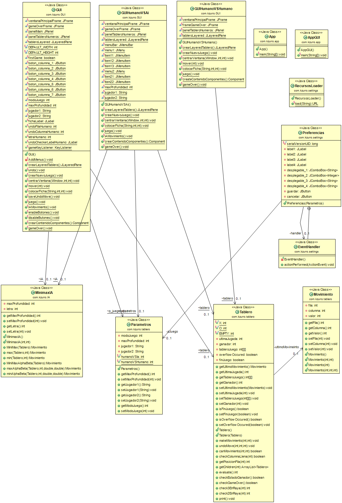

# **INTELIGENCIA ARTIFICIAL**

## **PRÁCTICA: Juegos bipersonales. Cuatro en Raya**  
_Realizada: mayo2019_

**Contenido:**

Esta práctica consiste en la implementación de alguno de los algoritmos de juegos bipersonales (al menos minimax). El juego de aplicación será las Cuatro en raya.

Las cuatro en raya es un juego de mesa en el que dos jugadores realizan alternativamente su jugada colocando fichas de dos colores diferentes (p.e. rojas para el que juega en primer lugar y verdes para el otro) en un tablero vertical de 7 columnas con 6 posiciones cada una de ellas. Cada jugada consiste en colocar una ficha en una columna. Esta ficha se colocará en la posición libre más baja de todas las de la columna elegida.

El juego termina cuando se da alguna de las siguientes situaciones:

- Se han alineado cuatro fichas del mismo color en diagonal, horizontal o vertical sin tener entre ellas ninguna ficha del otro color (cuatro en raya). En este caso gana el jugador que consigue colocar las cuatro en raya.  
- Todas las posiciones de todas las columnas están ocupadas por fichas sin llegar a obtenerse cuatro en raya. En este caso se produce un empate.

El programa debe permitir configurar el número máximo de jugadas por adelantado que se analizarán (profundidad del Árbol).

## DATOS

- Fork de [Iptamenos/Connect4](https://github.com/Iptamenos/Connect4) con [MIT License](https://github.com/Iptamenos/Connect4/blob/master/LICENSE)    
- [Memoria](./documentacion/memoria.md)
-  Diagrama de Clases de Diseño 
