# PRACTICA CUATRO EN RAYA

_Autor: kzurro_

_Realizado: mayo-2019_


**INDICE** **:**

    1. BIBLIOGRAFÍA
    2. PROPUESTA DE PRACTICA. OBTENCION DE LA INFORMACION
    3. DISEÑO
    4. IMPLEMENTACIÓN
    5. INSTRUCCIONES
    6. ESTUDIO DE RENDIMIENTO
    7. GENERALIDAD DE LA SOLUCIÓN


1. **BIBLIOGRAFÍA**
   - [http://www.ia.urjc.es/grupo/docencia/fia/](http://www.ia.urjc.es/grupo/docencia/fia/)
    - Laboratorio de Inteligencia Artificial (Universidad Autónoma de Baja California)
    - [http://www.lsi.upc.edu/~bejar/ia/material/trabajos/Algoritmos\_Juegos.pdf](http://www.lsi.upc.edu/~bejar/ia/material/trabajos/Algoritmos_Juegos.pdf)
    - [https://www.lawebdelprogramador.com/codigo/Java/313-Cuatro-en-Ralla.html](https://www.lawebdelprogramador.com/codigo/Java/313-Cuatro-en-Ralla.html)
    - [https://es.wikipedia.org/wiki/Minimax](https://es.wikipedia.org/wiki/Minimax)
    - [Connect-4](https://github.com/Iptamenos/Connect4)


1. **PROPUESTA DE PRACTICA. OBTENCION DE LA INFORMACION**

    **Propuesta de trabajo**

    Práctica de la primera parte de la Asignatura de Inteligencia Artificial del curso de xxxxxxxxxxxxxx, consistente en desarrollar el juego de 4 en Raya

    **Las condiciones técnicas que debe cumplir la práctica:**  
      - El desarrollo debe ser realizado en Lenguaje de programación Java  
      - Se debe implementar una interfaz gráfica  
      - Implementar el Algoritmo minimax  
      - Implementar poda AlphaBeta  
      - Permitir configurar el numero de niveles a analizar (profundidad del árbol) por adelantado.  


    **Obtención de la Información**

    El objetivo es implementar el algoritmo minimax a un juego bipersonal que permita la configuración de la dificultad mediante la configuración por adelantado del numero de jugadas que se anualizarán.

    El algoritmo minimax conoce el estado del otro jugador, selecciona el mejor movimiento.

    La implementación del algoritmo minimax se ha llevado a cabo en el juego cuatro en Raya, que consiste en un tablero de 6x7 (6 filas, 7 columnas), cuyo objetivo es colocar fichas y conseguir alinear 4 del mismo color, en cualquier dirección, según sea el turno de cada jugador.  
1. **DISEÑO**

    El código se encuentra comentado para saber la funcionalidad de cada una de las funciones desarrolladas

    Se ha desarrollado por un lado el juego y por otro lado la interfaz gráfica y por otro la lógica del juego:

    1. **Interfaz gráfica:**
    Se han desarrollado dos interfaces gráficas para mostrar los dos modos de juego existentes, Humano VS IA (inteligencia artificial) y Humano VS Humano.

    1. **Lógica de juego:**
        - Por un lado, se ha realizado el tablero del cuatro en raya y las reglas de juego. Implementando por un lado la configuración del tablero y por otro los movimientos que se pueden realizar y en que consiste el éxito del juego.
        - Por otro, se ha implementado el Algoritmo minimax y minimax con Poda Alpha Beta.
        - El algoritmo minimax `(\CuatroEnRaya\src\com\kzurro\IA\MinimaxIA)` devuelve la acción que corresponde al mejor movimiento posible, esto es, el movimiento que tiene la mejor utilidad, asumiendo que el otro jugador juega para minimizar la utilidad. Las funciones de maxValue y minValue crean el árbol de juego completo a través de sus llamadas recursivas y guardan la mayor y menor utilidad respectivamente de todas las hojas derivadas de ese estado. La utilidad se comprueba de abajo hacia arriba siendo la llegada a un estado terminal o alcanzar la profundidad máxima las condiciones de salida de las funciones.
        - El algoritmo minimax con Poda Alpha Beta `(\CuatroEnRaya\src\com\kzurro\IA\MinimaxIA)`, mejora el algoritmo minimax, aplicandose en espacios de estado demasiado grandes como para analizar todos los nodos. Evita revisar porciones dominadas del árbol, que no pueden proveer información útil sobre la jugada siguiente.


4. **IMPLEMENTACIÓN**

    La aplicación consta de 5 paquetes:  


    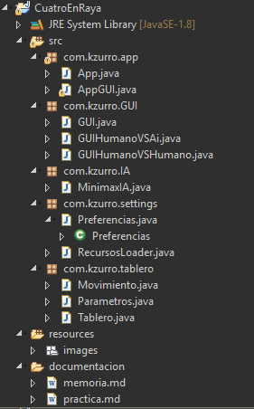

    1.  **`com.kzurro.tablero`** : Donde está el &quot;campo de juego&quot; y reglas, con tres clases.
        - Tablero en el que se implementa el tablero de 7 columnas y 6 filas y los métodos relativos a los diferentes estados y evaluaciones del juego
        - &quot;Movimiento&quot; en el que se implementa que es un movimiento en el cuatro en raya
        - &quot;Parametros&quot; parámetros necesarios de juego donde cabe resaltar el nivel de dificultad que será (maxProfundiad) que utiliza la clase  MinimaxIA

      1. **`com.kzurro.IA`** : Core de la aplicación donde se encuentra los algoritmos necesarios:
          - MinimaxIA en el que se implementan las funciones de evaluación y los algoritmos minimax y minimax con poda (minimaxAlfaBeta).

      1. **`com.kzurro.settings`** : Con dos clases donde se han implementado las preferencias de juego que tendrán la interfaz grafica (GUI).

      1. **`com.kzurro.GUI`** : Se han implementado tres clases para poder ver las distintas pantallas que se presentan al usuario. El jugador IA utilizara el método minimax con poda.

      1. **`com.kzurro.app`** : Con dos clases de diseño:
          - Para ejecutar la aplicación mediante la interfaz gráfica
          - Para ejecutar la aplicación mediante la consola


1. **EJECUCIÓN**

    La aplicación está diseñada para poder ser ejecutada desde el IDE (entorno de desarrollo) en el paquete App, se ha procurado comentar los métodos (en el código) para poder facilitar la comprensión del mismo, mantenimiento  y su posible reutilización en otro tipo de juegos


1. **INSTRUCCIONES**

    1. **Código** : Siguiendo la descripción del apartado 3 se puede ver el código en las diferentes clases. El paquete com.kzurro.app tiene dos métodos main, el primero de ellos App se encuentra la ejecución de la aplicación por consola y el segundo el código de ejecución de la aplicación por la interfaz gráfica:
    - `App`: Es posible ejecutar la aplicación por consola, en modo Humano VS IA (inteligencia Artificial), con un nivel de dificultad de 7 que es el nivel de explotación de profundidad del algoritmo minimax. Hasta nivel 7 un procesador i7Gen 8 la respuesta del ordenador es casi inmediata a valores mayor de profundidad aumenta el costo de procesamiento y el tiempo de respuesta. El que inicia el juego es el jugador humano  
    `app`  
        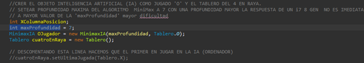
    Para modificar la dificultad hay que cambiar el valor de la variable:
        ```java
          int maxProfundidad  
        ```

    Para modificar el orden de los jugadores, es decir, para que comience jugando IA se debe &quot;descomentar&quot; la siguiente línea de código:
      ```java
        CuatroEnRaya.setUltimaJugada(Tablero. **X** ); 
      ```
    - `AppGUI`: La interfaz es la misma a la que se entrega en el archivo .jar de ejecución de la aplicación.
   **Archivos**.jar:
    - `CuatroenRaya\_Consola.jar`: Es la ejecución de la App por consola sin interfaz grafica

      Para ejecutar la aplicación(Windows) hay que abrir una terminal e introducir el comando que viene en la imagen siguiente.
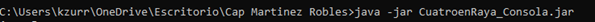
      Para poder Jugar  
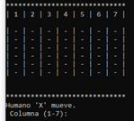     
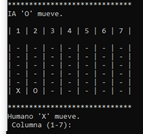

      El jugador humano tiene fichas “X”, para introducir una ficha hay que poner un numero entre 1-7 (según la columna en la que se quiera introducir la ficha) y pulsar intro. El Jugador IA tiene fichas “O”

    - `CuatroenRaya\_GUI.jar`: Es la ejecución de la `App` por interfaz gráfica, para ello hay que hacer doble click sobre el icono de la App   
      

      - Aparecerá la siguiente pantalla  

      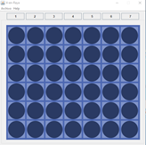


      Por defecto esta configurado para empezar a jugar en modo Humano VS IA en  nivel de profundad 4 (dificultad) con fichas color rojo para Humano y amarillas para IA.

     - Para cambiar las preferencias de juego hay que seguir los siguientes pasos:    
      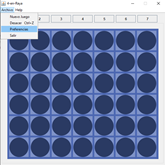  
      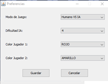  
      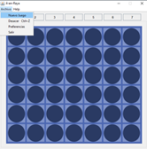  
    En el que se podrán seleccionar el modo de juego entre Humano Vs IA y Humano Vs Humano, Nivel de dificultad y color de las fichas de los jugadores.

    El resto de opciones del desplegable son las propias de un juego de estas características.


    - La pestaña &quot;Help&quot; de la barra de Tareas explica &quot;el como se juega al cuatro en Raya&quot;  
       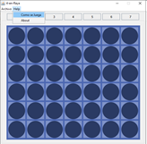

7. **ESTUDIO DE RENDIMIENTO**

El análisis se ha realizado entre el algoritmo minimax y minimax con poda. Los tiempos se han medido sobre la aplicación de consola en el IDE y el jugador humano siempre realizando la misma jugada en primer lugar.  
  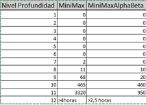    
  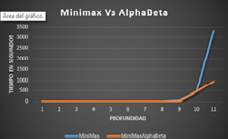


El algoritmo minimax depende mucho de la función de utilidad para tomar la decisión correcta, por lo que debe ser estudiado el juego para conseguir una buena heurística. A mayor profundidad será más difícil derrotar al ordenador, pero eso trae un costo importante en tiempo y memoria, por lo que se requieren aplicar mejoras a dicho algoritmo como lo es AlphaBeta.


8. **GENERALIDAD DE LA SOLUCIÓN**

El algoritmo minimax y minimax con poda se han implementado con un débil acoplamiento facilitando su reutilización en otros juegos bipersonales como el Ajedrez, el Othelo y Go. Solo habría que modificar la Clase Tablero y Movimiento configurando para el juego que se deseara jugar.